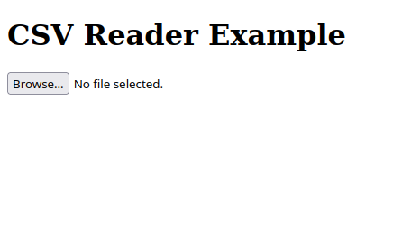
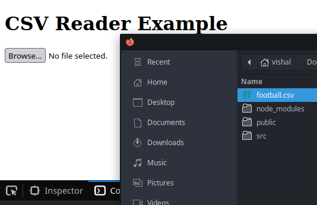
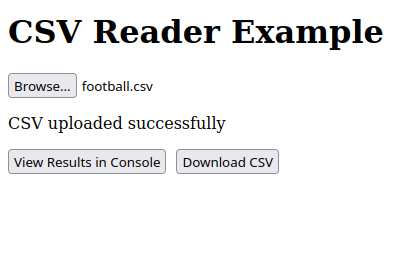
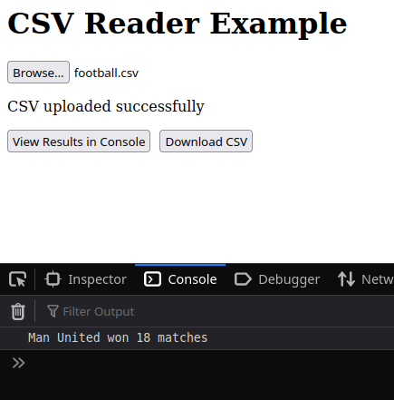

# CSV Upload Utility

This project includes a utility class for handling CSV uploads. This utility can be especially useful for processing different types of CSV files.

## Master Branch

The master branch includes the basic implementation of the CSV upload utility class in the `CSVReader.ts` file. The class includes basic functionality for reading CSV files and parsing their contents. However, the implementation is not generic enough to be easily reusable or extensible for different types of CSV data.

## Refactor-1-Abstract-Classes Branch

The `refactor-1-abstract-classes` branch introduces a refactor of the `CSVReader.ts` file to make it more reusable and extensible by using abstract classes. In this approach, an abstract `CSVReader` class is defined which has methods for reading and parsing CSV files.

## Refactor-2-Interfaces Branch

The `refactor-2-interfaces` branch refactors the solution further by using interfaces. It introduces a `DataReader` interface, which specifies a contract for what methods a data reader should have. In this case, `DataReader` mandates that any class implementing it should have `readFile` and `parseCSV` methods. The `DataReader` interface allows us to define a contract for a data reader, promoting reusability across various types of data readers.

In this approach, we have a `MatchReader` class that utilizes an object implementing the `DataReader` interface to read and parse files. This class transforms the parsed data into an array of `MatchData`. It decouples the task of data reading and parsing from the task of data processing, resulting in more modular, maintainable, and testable code.

### The Strategy Pattern

The `DataReader` interface in this approach exemplifies the Strategy pattern. The Strategy pattern is a behavioral design pattern that turns a set of behaviors into objects and makes them interchangeable inside original context object. The original object, called context, holds a reference to a strategy object and delegates it executing the behavior.

In our case, `DataReader` is the strategy, and `MatchReader` is the context. `MatchReader` delegates the work of reading and parsing the file to the `DataReader`. This makes `MatchReader` flexible in terms of the source of its data, which can be a CSV file, an API, a database, or some other source.

The use of the Strategy pattern solves the problem of tightly coupled components. Without this design, `MatchReader` would be tightly coupled to `CSVReader`, and any changes to how files are read or parsed would require changes to both `MatchReader` and `CSVReader`. By using interfaces, responsibilities are clearly separated. This makes the system easier to test, maintain, and extend, as new types of data readers can be added without changing the existing classes.

### Run Code

Clone the repo, run `npm run dev`, upload the included `football.csv`. Fire up the developer console, and checkout the output. 

### Application Screenshots (Available on Refactor-2-Interfaces Branch)

When you run `npm run dev`

When you click on `Browse`

When you upload the file

When you click on `View Results in Console`

Similarly you can also download the pdf. 
